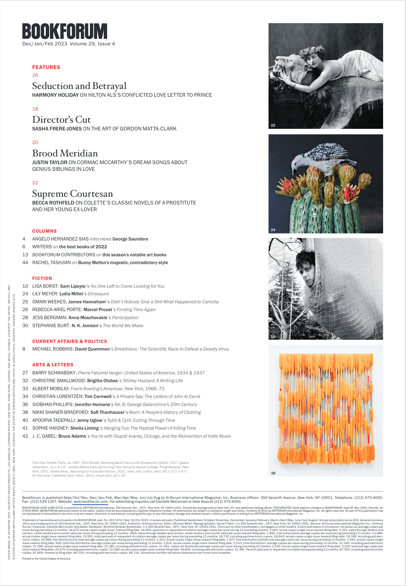
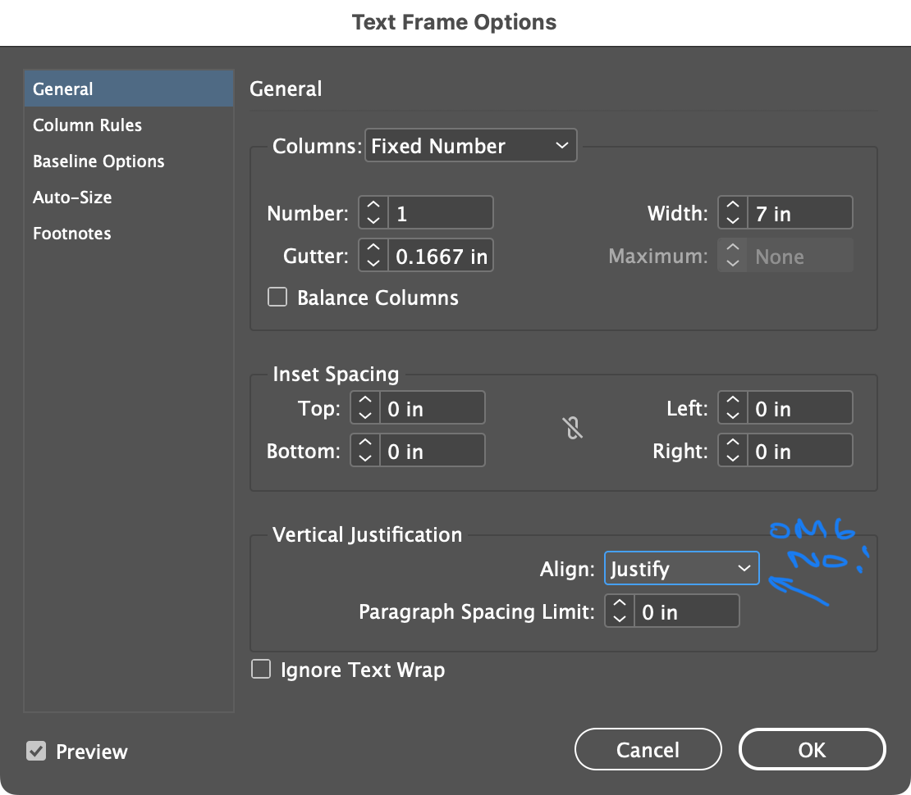

# Week 5 Wrap-up

## *Bookforum* versus *Communication Arts*
We looked at two different publications and noticed that one approached typography with respect and skill, while the other was less sophisticated—to the extent that it bothered us even when we weren’t immediately sure why.

The first publication was *Bookforum*. It’s a literary magazine, and its love of words is clearly reflected in the typography.

It starts with the table of contents. There’s a clear set of rules for how they treat features versus the rest of the magazine. The use of color is sparing, but effective in helping navigate a dense list of information. Alignment is well considered. Note the use of weight, caps, serif and sans-serif, positioning, and color to clarify and differentiate all the information that must be conveyed—article authors, book authors, article titles, book titles, sections, and page numbers. This is a deep, and very well established, hierarchy. Just keep looking and you’ll notice even more to appreciate. Overall, the typography is elegant and complex; it simplifies the way we are to understand the system of information laid out in the rest of the magazine.

 
 

> 

 
 

Beyond the table of contents, the magazine does a great job in presenting a lot of text in a systematized yet variable way that is dynamic and avoids monotony. For example, while adhering to grids and well-defined styles, articles will have two, three, or four columns per page, and sometimes they are asymmetrical. They are riffs on a firmly established, easily recognizable style.

(Tragically, the issue we looked at is the final issue. <https://www.nytimes.com/2022/12/12/books/bookforum-magazine-closing.html>)

Then, we looked at *Communication Arts*, expecting to see good examples of typography. Our expectations were crushed. Despite being a publication about visual communication, the magazine’s typography had some issues that were unsettling. The biggest issue was the (ab)use of vertical justification within text frames, making line-spacing inconsistent and arbitrary across entire spreads. Note here that the first lines across columns align at the baseline as expected. Then, the final lines in the text frames are also aligned. But all of the other lines are out of alignment and the leading/line-spacing is different in each column. (This is most noticeable on the left side of the spread.) And it’s not caused by an acceptable, deliberate use of 1.5× paragraph spacing. In this case, it would have been better to have uneven column lengths than varying, inconsistent, and disorienting line-spacing. 

 
 

> 

 
 

**The culprit**—Text Frame Options→Vertical Justification→Align:Justify in Text Frame Options. This setting will override your leading value with an arbitrary number, merely to make the last lines of columns align horizontally along the bottom of the text frame. This is rarely a good idea. Never use it on columns of text. If you need that kind of alignment, consider a baseline grid, use paragraph indents, or use 2× paragraph spacing.

 
 

> 

 
 

Here’s a [PDF](images/communication-arts.pdf) of the *Communication Arts* magazine issue that we examined. The *Bookforum* issue is harder to access without a subscription. But you can find it on Flipster via the San Francisco Public Library at <https://flipster-ebsco-com.ezproxy.sfpl.org/plink/reader/gswfel/3463025>. 

## And redesigned flyers
*The Washington Post* requires a subscriptions to read the article, but Apple News offers it for free. “Many signs in NYC could use an artist’s touch. This man is doing it for free, incognito.” <https://apple.news/A0eTNoWoSQQqZpxO4jF5B-A>

## Beyond this course

* **Continue looking and seeing**. There is so much to learn by closely examining a great typographical example. Look for thoughtful, well-executed works. As we learned this week, design magazines may not be a great source; maybe literary sources are better. Respected publishers tend to appreciate and employ good design. McSweeney’s comes to mind, <https://store.mcsweeneys.net>. And William Stout Architectural Books has a great concentration of art and architectural publications, <https://stoutbooks.com/>.
* **Copy great examples**. Try your hand at making a copy of a high-quality spread or page. The process of replicating all the tiny decisions of a good typographer will help you understand so much more, especially scale, spacing, proportions, hierarchy, and alignment. Remember to work to your example’s exact page dimensions.
* **Reference Butterick’s Practical Typography**. <https://practicaltypography.com> This is such a great reference and a fundamental resource. Refer often to the punctuation section so you don’t accidentally make tell-tale typographical mistakes related to quotes, apostrophes, and dashes.
* **Print**. Always print your work at 100% scale, even if you have to print in tiles. Proportions can be deceiving on a computer screen. This is especially true if you’re working on a larger piece like a poster. Seeing actual type, at scale and on paper, will save you a lot of frustration during your design and production process.
* **Remember your intent and your reader**. There will often be obvious choices that will solve your typographical problem—at micro and macro scales—if you keep in mind the conceptual drivers and the overall, core purpose of the project. Remember the continuum between Massimo Vignelli and David Carson—conservative/expressive, legible/illegible, informative/emotive, and all the degrees in between. When you think you’re done with a project, reevaluate it according to your original goals.

## Publications and resources

### *Thinking with Type* by Ellen Lupton
* Borrow from the Internet Archive <https://archive.org/details/thinkingwithtype0000lupt_h9e8>
* <https://papress.com/products/thinking-with-type-second-revised-expanded-edition-a-critical-guide-for-designers-writers-editors-students>

### *Typography Essentials: 100 Design Principles for Working with Type* by Ina Saltz
* Borrow from the Internet Archive, older edition https://archive.org/details/typographyessent0000salt
* <https://www.amazon.com/Typography-Essentials-Revised-Updated-Principles/dp/1631596470>

### *The Elements of Typographic Style* by Robert Bringhurst
* Borrow from the Internet Archive <https://archive.org/details/isbn_9780881791327>
* <https://en.wikipedia.org/wiki/The_Elements_of_Typographic_Style>

### *Universal Principles of Design*
* Website <https://universalprinciplesofdesign.com>
* Book <http://www.amazon.com/exec/obidos/ASIN/1592535879/amsi-20>

### Butterick’s Practical Typography 
* <https://practicaltypography.com>
* Further bibliography <https://practicaltypography.com/bibliography.html>

### Design Observer
<https://designobserver.com/main.php>

### Print Magazine
Typography articles <https://www.printmag.com/categories/typography>

### Typographica
<https://typographica.org>

## Mechanics and tools—training and tutorials
* Adobe https://helpx.adobe.com/indesign/view-all-tutorials.html
* LinkedIn Learning through the San Francisco Public Library https://www.linkedin.com/learning-login/go/sfpl. Follow the Typography skill set.
* Adobe InDesign Classroom in a Book (2023 Release). O’Reilly Learning through the San Francisco Public Library https://learning-oreilly-com.ezproxy.sfpl.org/library/view/adobe-indesign-classroom/9780137967506/
